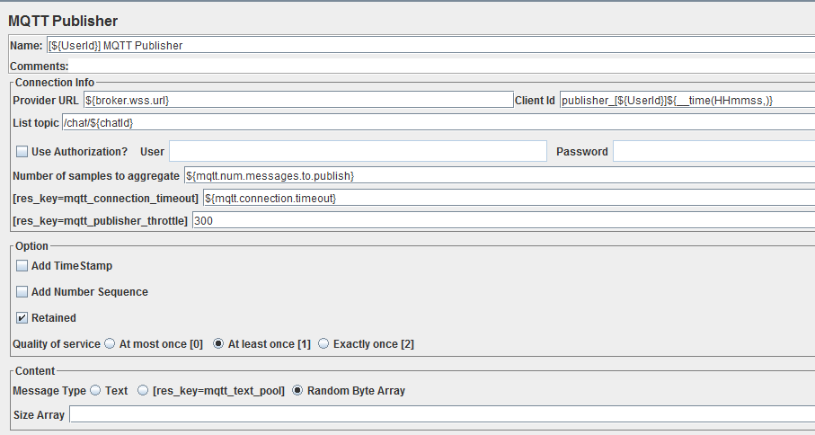
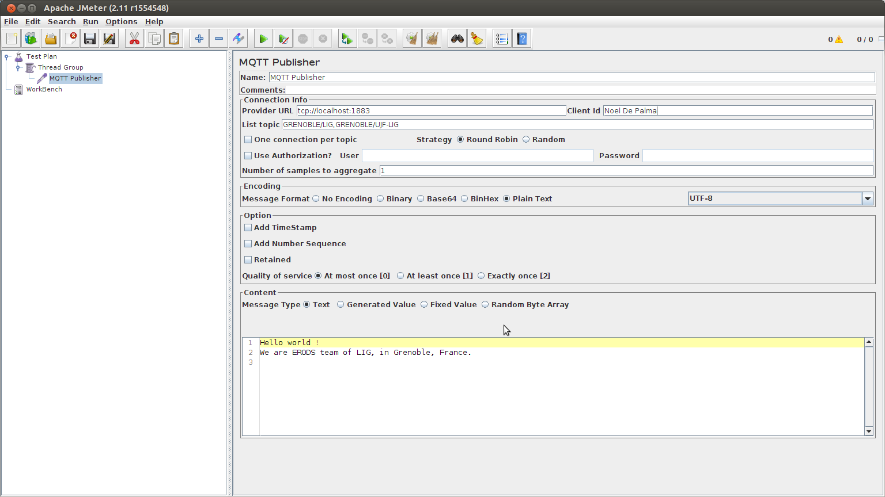
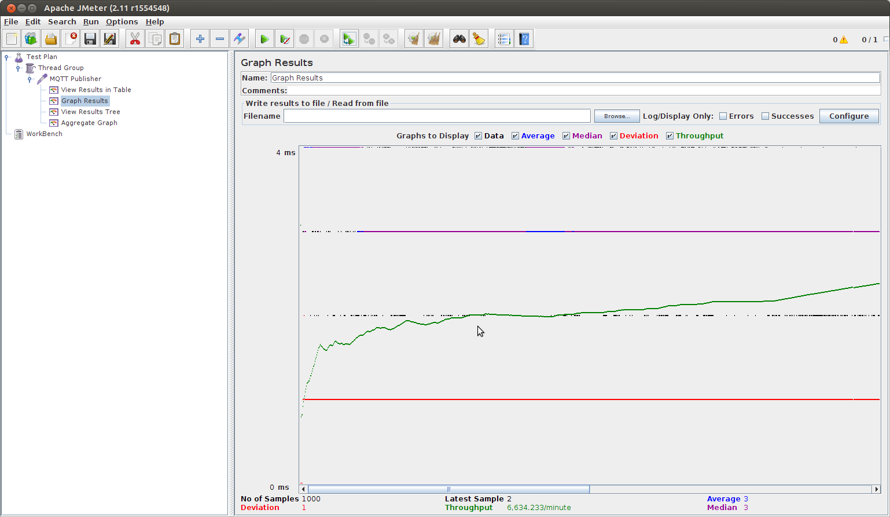
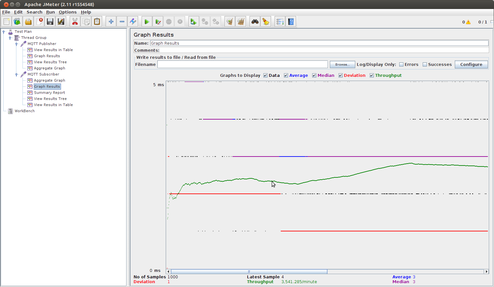
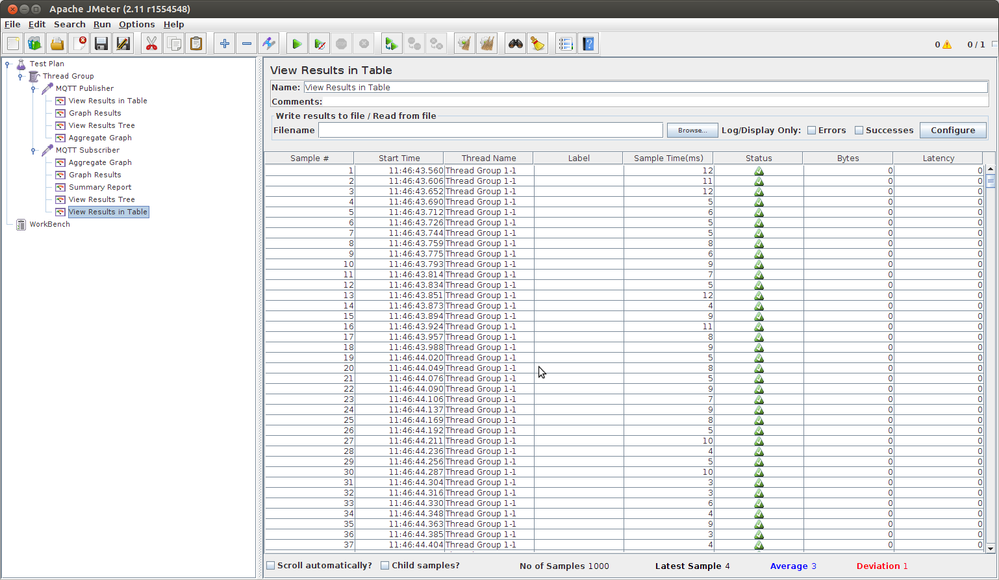

mqttws-jmeter
===========

Jmeter MQTT sampler with support for websockets 

Initially a fork of https://github.com/tuanhiep/mqtt-jmeter.

# Introduction

The MQTTWS Plugin in Jmeter is used for the injection testing of MQTT brokers. 
It uses paho client (https://repo.eclipse.org/content/repositories/paho-snapshots/) 
that supports MQTT over tcp, websockets and secure websockets.

# How to install MQTT plugin in Jmeter

From the repository: https://github.com/winglet/mqttws-jmeter  
Get the source code, go to mqttws-jemeter folder and and use the command maven in terminal (Ubuntu):

	mvn clean install package
or (eclipse with maven support http://www.eclipse.org/m2e/) select pom.xml and "Run As" "maven clean" and then "Run As" "maven install".

This should result in the file **mqttws-jmeter.jar** in **mqttws-jmeter/target**.  
Put the **mqttws-jemeter.jar** in the folder **lib/ext** of Jmeter
(to be downloaded on http://jmeter.apache.org/download_jmeter.cgi ).

It's necessary to update the file **ApacheJMeter_core.jar** in the repository lib/ext of Jmeter (that is if you care to see MQTTWS strings properly in GUI).
Update the file messages.properties in the folder :/org/apache/jmeter/resources/
in **ApacheJMeter_core.jar** by new file messages.properties from
https://github.com/winglet/mqttws-jmeter/tree/master/ressource

##  MQTTWS Publisher

Right-click “Thread” and choose : Add → Sampler → MQTT Publisher

In the principal interface of MQTTWS Publisher we have the fields:  
*Connection Info*  

**Name:** Name of the MQTTWS Publisher  
**Comments:** Your comments  
**Provider URL:** the address of MQTTWS server example: tcp://localhost:1883  
**Client Id:** Your Id in the session with MQTTWS server example: Noel De Palma  
**List Topic:** The topic name you want to publish to  
**Use Authorization check box:** Necessary in the case the connection needs the username and
password  
**User:** Your username  
**Password:** Your password  
**Number of samples to aggregate:** In other way, the number of messages you want to publish to
the MQTT sever in this MQTT Publisher thread, with the value like the configuration below.  
**Message Type:** You can choose : Text, Random Byte Array (more detail below)  

  

*Option*  

**Add TimeStamp check box:** Add the timestamps to the message. The timestamps is 8 bytes  
**Add Number Sequence check box:** Add the number sequence to the message. Example: if you
publish 100 messages in your session, the message is numbered from 0 to 99. The number sequence 
field in the message is 4 bytes.  
**Retained check box:** You publish the messages as retained messages or not. The retain flag for an
MQTT message is set to false by default. This means that a broker will not hold onto the message 
so that any subscribers arriving after the message was sent will not see the message. By setting 
the retain flag, the message is held onto by the broker, so when the late arrivers connect to the 
broker or clients create a new subscription they get all the relevant retained messages”  
**Quality of service:** Three levels:  
0 : At most once  
1 : At least once  
2 : Exactly once  

With MQTT Publisher in Jmeter, three type of messages can be sent (Message Type):  

**Text**

Text send as is.

**Random Byte Array:**  

The data in form of random byte array with the size array as an input.  

For measuring, thanks to Jmeter, we can add some listeners:  
  
  

## MQTT Subscriber  
 
 
  
 
 
 
*Name:* Name of the MQTT Subscriber  
*Comments:* Your comments  
*Provider URL:* The address of MQTT server  
*Client Id:* Your Id in the session  
*Topic:* The topic you want to subscribe.  
*Use Authorization :* Necessary in the case the connection need username and password  
*User:* your username  
*Password:* your password  
*Number of samples to aggregate:* In other way, the number of message you want to receive from
the topic in one session  
*Time out (milliseconds):* Timeout for the connection to receive message from the topic  

  
 
 
  
  
    
